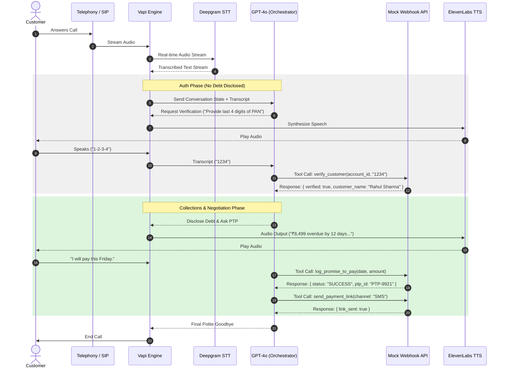

# High-Level Design Document
## "Maya" — Automated Outbound Voice AI Collections Agent
### Client: Kapture Finance

**Version:** 1.0
**Author:** Engineering Team
**Date:** August 2026

---

## 1. Overview

Maya is an outbound Voice AI collections agent built on Vapi.ai that calls customers with overdue EMI payments, authenticates their identity, discloses the outstanding amount only after verification, negotiates a resolution (Promise-to-Pay, dispute, hardship, already-paid, or opt-out), and logs a structured disposition for every call — with zero human involvement in the happy path and clean escalation paths for edge cases.

This document covers system architecture, latency budget, the conversation state machine, intents/entities, tool/API contracts, data-safety and compliance rules, edge-case handling, and observability.

---

## 2. Pipeline & Latency Budget

### 2.1 Architecture

```
Telephony (SIP/PSTN)
      │
      ▼
Vapi Engine (orchestration layer)
      │
      ├──► STT: Deepgram Nova-2 (real-time streaming transcription)
      │
      ▼
Orchestrator / LLM: GPT-4o (or GPT-4o-mini), temperature 0.1
      │
      ├──► Tool calls ──► Mock Webhook API (Node.js/Express)
      │
      ▼
TTS: ElevenLabs / Cartesia (voice: "Sarah" / "Rachel")
      │
      ▼
Telephony Output → Customer
```

### 2.2 Sequence Diagram (Mermaid)



*(See `docs/System_Architecture.png` for a rendered version, or view the Mermaid source above directly on GitHub.)*

### 2.3 Latency Budget

| Hop | Component | Target Latency | Notes |
|---|---|---|---|
| 1 | STT (speech recognized) | ~200 ms | Deepgram Nova-2 streaming, telephony-tuned model |
| 2 | LLM first byte (time to first token) | ~400 ms | GPT-4o at temperature 0.1; kept low for deterministic compliance behavior |
| 3 | TTS synthesis (first audio chunk) | ~300 ms | ElevenLabs/Cartesia streaming synthesis, starts before full LLM response completes |
| 4 | Network / telephony overhead | ~200 ms | SIP trunk + Vapi orchestration overhead |
| **Total round-trip (target)** | | **< 1.2 s** | End of user speech → start of agent audio response |

**Tool-call latency:** Mock webhook responses are expected to return in <150 ms (in-memory operations, no external DB). Any tool exceeding 2s should trigger a filler phrase ("Just a moment while I check that...") to preserve conversational flow.

---

## 3. Conversation State Machine

### 3.1 States

| State | Description | Entry Condition |
|---|---|---|
| `INIT` | Call connects, greeting delivered | Call answered |
| `AUTH_PENDING` | Awaiting/verifying identity | Customer confirms they are (or might be) the target |
| `AUTHENTICATED` | Identity confirmed, debt may be disclosed | `verify_customer` returns `verified: true` |
| `NEGOTIATION` | Debt disclosed, intent being identified | Immediately after `AUTHENTICATED` |
| `PTP_COLLECTED` | Promise-to-Pay captured | `log_promise_to_pay` succeeds |
| `ESCALATED` | Handed to human agent / grievance desk | `escalate_to_agent` called (hardship/dispute) |
| `CALL_ENDED` | Disposition logged, call terminated | `mark_disposition` called |

### 3.2 State Diagram

```
INIT ──(confirms identity)──► AUTH_PENDING ──(verify_customer: success)──► AUTHENTICATED
  │                                │
  │ (wrong person/unavailable)     │ (verify_customer: fail x2)
  ▼                                ▼
CALL_ENDED ◄─────────────────── CALL_ENDED

AUTHENTICATED ──► NEGOTIATION ──┬─(PTP)────────► PTP_COLLECTED ──► CALL_ENDED
                                 ├─(already paid)──────────────────► CALL_ENDED
                                 ├─(hardship/dispute)──► ESCALATED ─► CALL_ENDED
                                 └─(DNC / abusive / silence)────────► CALL_ENDED
```

### 3.3 Hard Rule (Compliance Gate)

> **Transitions out of `AUTH_PENDING` to `AUTHENTICATED` are strictly locked behind the successful return of `verify_customer(status: success)`.** No debt-related term (overdue, loan, EMI, amount, Kapture Finance debt) may be spoken by the agent prior to this transition, under any user pressure or phrasing.

---

## 4. Intents & Entities Table

### 4.1 Intents

| Intent | Trigger Examples | Resulting Branch |
|---|---|---|
| `Confirm_Identity` | "Yes, this is Rahul" | → AUTH_PENDING |
| `Promise_To_Pay` | "I'll pay Friday" | → PTP flow |
| `Hardship_Claim` | "I lost my job", "I can't pay right now" | → Escalation (hardship) |
| `Dispute_Debt` | "I never took this loan" | → Escalation (dispute) |
| `Already_Paid` | "I paid yesterday via UPI" | → Already-paid flow |
| `Request_DNC` | "Stop calling me" | → Immediate DNC close |
| `Wrong_Person` | "This isn't Rahul" | → Wrong-person close |

### 4.2 Entities

| Entity | Type | Format | Example |
|---|---|---|---|
| `PTP_Date` | Date | ISO-8601 | `2026-08-14` |
| `PTP_Amount` | Number | INR, integer | `8499` |
| `Hardship_Reason` | String | Free text | `"lost job"` |
| `Verification_Code` | String | 4-digit PAN or birth year | `"1234"` / `"1995"` |

---

## 5. Tool / API Specifications

All tools are registered as Vapi function-calling tools (see `vapi/tool_definitions.json` for full JSON schemas) and are backed by a single webhook endpoint (`mock-server/server.js`).

| Tool | Purpose | Required Args | Key Response Fields |
|---|---|---|---|
| `verify_customer` | Authenticate caller before any disclosure | `account_id`, `verification_code` | `verified`, `customer_name`, `message` |
| `log_promise_to_pay` | Record a PTP commitment | `account_id`, `ptp_date`, `amount` | `success`, `ptp_id`, `confirmed_date`, `amount` |
| `send_payment_link` | Dispatch payment link via SMS/WhatsApp | `account_id`, `channel` | `success`, `payment_link`, `message` |
| `escalate_to_agent` | Route hardship/dispute cases to a human | `account_id`, `reason` | `success`, `ticket_id`, `message` |
| `mark_disposition` | Log final call outcome (called once, at close) | `account_id`, `status` | `success`, `disposition_logged`, `timestamp` |

Full request/response JSON payloads are documented inline in `vapi/tool_definitions.json` and implemented in `mock-server/server.js`.

---

## 6. Auth & Data Safety Protocols

- **PII masking in logs:** Customer names are masked before being written to any log (e.g., `Rahul Sharma` → `Rahul S****`). Verification codes are never logged in plaintext (`****`).
- **Zero-disclosure-before-auth:** The system prompt hard-codes a rule that terms like "overdue", "loan", "EMI", or "Kapture Finance debt" cannot be spoken until `verify_customer` returns `verified: true`. This is enforced at the prompt level and validated in `tests/test_cases.json` (TC-001, TC-007, TC-008).
- **Least-privilege disclosure:** Even post-authentication, only the fields required for the conversation (amount, DPD, loan type) are surfaced — no full PAN, no other account numbers, no data belonging to other accounts.
- **Third-party protection:** If the person on the call is not the verified customer, no account information is disclosed under any circumstance (see TC-007).
- **Transport:** In production, the webhook endpoint should sit behind HTTPS (ngrok/Render/Vercel all provide this by default) and validate a shared secret header from Vapi.

---

## 7. Compliance & Guardrails

- **RBI Fair Practices Code alignment:**
  - Calls presumed within the permitted window (08:00–19:00 local time).
  - No threats, harassment, or intimidating tone — one calm warning on abusive language, then graceful termination.
  - Instant compliance with Do-Not-Call requests — no further negotiation once requested.
- **Hallucination prevention:**
  - Agent cannot offer unauthorized waivers greater than 10% of the outstanding amount.
  - Agent cannot extend due dates beyond 30 days without escalation.
  - Agent cannot make legal threats or reference credit bureau action in a coercive tone.
  - Any request outside these bounds is routed to `escalate_to_agent`.
- **Low temperature (0.1):** The LLM is configured with a low temperature specifically to keep compliance-critical phrasing (the zero-disclosure gate, disposition logging) deterministic and repeatable across calls.

---

## 8. Edge Cases Matrix

| Edge Case | Trigger | Expected Behavior |
|---|---|---|
| Abusive user | Insults / hostile language | 1 calm warning → if continues, `mark_disposition(ABUSIVE_TERMINATED)` → hangup |
| Silent user / voicemail | No speech detected | 2 re-prompts → `mark_disposition(NO_RESPONSE)` → hangup |
| Mid-call language switch | English ↔ Hindi/Hinglish | Agent switches fluidly, retains state and entities already captured |
| Failed verification | Wrong code twice | No disclosure at any point; polite close, no disposition of "verified" |
| Wrong number / third party | "This isn't Rahul" | No disclosure; `mark_disposition(WRONG_PERSON)` |
| Dispute | "I never took this loan" | `escalate_to_agent(DISPUTE)`; no arguing |
| Hardship beyond policy | Requests waiver > 10% or extension > 30 days | Escalate — never improvise beyond policy bounds |
| DNC request | "Stop calling me" | Immediate `mark_disposition(DO_NOT_CALL)`, no further negotiation |
| Tool timeout | Webhook call exceeds ~2s | Agent uses a filler phrase, retries once, then gracefully explains a system delay if it persists |

---

## 9. Observability Metrics

| Metric | Definition | Why It Matters |
|---|---|---|
| **Containment Rate** | % of calls resolved without human escalation | Measures how often Maya can fully own a call end-to-end |
| **PTP Rate** | % of calls ending in a valid, logged Promise-to-Pay | Core business KPI — direct proxy for collections effectiveness |
| **First Call Resolution (FCR)** | % of calls ending in a valid, unambiguous disposition (not `NO_RESPONSE` or dropped) | Tracks conversational completeness / reliability |
| **Auth Success Rate** | % of `AUTH_PENDING` calls that reach `AUTHENTICATED` | Flags verification-flow friction or fraud patterns |
| **Average Latency (P50/P95)** | STT→LLM→TTS round-trip per turn | Ensures conversational naturalness stays within the 1.2s budget |
| **Escalation Rate by Reason** | % of calls routed to `escalate_to_agent`, broken down by `HARDSHIP_REQUEST` / `DISPUTE` | Informs policy tuning and human-agent staffing |
| **Compliance Violations (target: 0)** | Any call where a debt term is spoken pre-authentication | Hard compliance metric — logged from transcript audits, should always be zero |

---

## 10. Future Enhancements

- Real-time compliance monitoring: an automated transcript scanner flagging any pre-auth debt-term mentions in production for audit.
- Multi-language TTS/STT expansion beyond English/Hindi (e.g., Tamil, Telugu, Bengali).
- Dynamic risk-based verification (step-up auth for high-value accounts).
- CRM integration to replace the in-memory mock database with a real customer ledger.
- A/B testing of negotiation phrasing to optimize PTP rate without compromising compliance tone.
